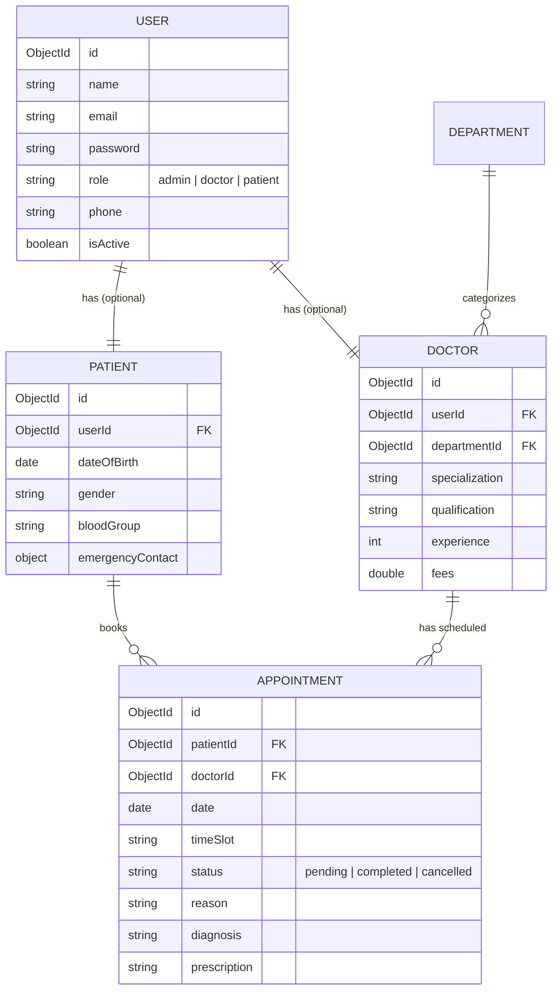

# 🏥 MediFlow - Advanced Hospital Management System

[](https://nodejs.org/)
[](https://react.dev/)
[](https://www.mongodb.com/)
[](https://expressjs.com/)
[](https://tailwindcss.com/)
[](https://vite.dev/)

**MediFlow** is a modern, full-stack Hospital Management System (HMS) designed to streamline medical workflows, appointment scheduling, patient records management, and administrative dashboards. Built with a highly responsive, modern glassmorphic interface, it offers tailored experiences for Patients, Doctors, and Administrators.

---

## 🚀 Key Features

### 👤 Role-Based Portals & Access Control
The application implements strict JSON Web Token (JWT) based authentication with middleware-enforced role access levels:

*   **🔑 Administrator Portal**
    *   **Live Dashboard Metrics**: High-level statistical summaries showing total doctors, registered patients, pending/completed appointments, and department distributions.
    *   **Doctor Directory**: Manage doctor records, assign specialized departments, set experience details, and configure consulting fees.
    *   **Department Admin**: Manage clinical departments with unique descriptions and visual tags.
    *   **System-wide Oversight**: View all scheduled appointments across the hospital.

*   **👨‍⚕️ Doctor Portal**
    *   **Appointment Management**: Track upcoming patient schedules. Mark appointments as completed, or reject/cancel slot requests.
    *   **Medical Records Log**: View historical visits and enter medical logs directly during or after patient consultations.
    *   **Performance Metrics**: Dashboard insights showing patient traffic, active cases, and cumulative consultation fees earned.

*   **🤒 Patient Portal**
    *   **Interactive Booking**: Choose a department, select from available specialist doctors, and instantly request an appointment slot.
    *   **Medical History Timeline**: Review personal past visits, prescriptions, and consult logs.
    *   **Profile Management**: Update critical health details (e.g., date of birth, blood group, emergency contact info, and home address).

---

## 🛠️ Tech Stack & Architecture

### Frontend (Client-side)
*   **Library**: React 19 (Functional components, custom hooks, context-driven state)
*   **Build Tool**: Vite (Lightning-fast HMR and building)
*   **Styling**: Tailwind CSS v4 & custom modern transitions
*   **Routing**: React Router DOM v7 (featuring Protected Route components)
*   **Charts**: Recharts (fully responsive SVG charting for portal statistics)
*   **Notifications**: React Hot Toast (sleek, non-intrusive action notifications)

### Backend (Server-side)
*   **Framework**: Express.js (Modular routers, custom logging, and validation middleware)
*   **Database**: MongoDB (utilizing Mongoose ODM for schemas)
*   **Security**: Bcrypt.js (salted password hashing) and JSON Web Tokens (secure authentication)
*   **Validation**: Express Validator (robust server-side request payload validation)

---

## 📊 Database Schema Design

MediFlow utilizes five core collection models representing hospital relationships:



---

## 🗺️ REST API Endpoints

### Authentication
*   `POST /api/auth/register` - Create a new user (and patient profile automatically if selected)
*   `POST /api/auth/login` - Authenticate credentials and return JWT
*   `GET /api/auth/me` - Get profile metadata of current authenticated user

### Administrative & Dashboards
*   `GET /api/dashboard/admin` - Fetch metrics and department breakdown charts for Admin
*   `GET /api/dashboard/doctor` - Fetch patient load and earnings metrics for Doctor

### Booking & Medical Workflow
*   `GET /api/doctors` - Retrieve all doctors or filter by department
*   `GET /api/departments` - Fetch list of active clinical departments
*   `GET /api/appointments` - Fetch role-relevant appointments (Patient, Doctor, or Admin)
*   `POST /api/appointments` - Book a new appointment slot
*   `PUT /api/appointments/:id` - Update appointment status, add diagnosis & prescription details

---

## ⚙️ Installation & Local Setup

Ensure you have [Node.js](https://nodejs.org/) (v18+) and [MongoDB](https://www.mongodb.com/try/download/community) installed locally.

### 1. Clone & Set Up the Repository
```bash
git clone https://github.com/aumpatro22/Hospital_Management_System.git
cd Hospital_Management_System
```

### 2. Configure Environment Variables
Create a `.env` file in the `/server` directory:
```env
PORT=5000
MONGODB_URI=mongodb://localhost:27017/hospital_ms
JWT_SECRET=your_super_secret_jwt_key
JWT_EXPIRE=7d
```

### 3. Install Dependencies
```bash
# Install root (frontend) dependencies
npm install

# Install server (backend) dependencies
cd server
npm install
cd ..
```

### 4. Seed the Database (Optional but Recommended)
Populate the database with pre-configured departments, doctors, and patient accounts:
```bash
npm run seed --prefix server
```
**Pre-seeded Logins:**
*   **Admin:** `admin@hospital.com` / `admin123`
*   **Doctor:** `sarah@hospital.com` / `doctor123`
*   **Patient:** `patient@hospital.com` / `patient123`

---

## 🏃 Running the Application

Open two terminals to run the client and API server concurrently:

#### Terminal 1 (Frontend Client)
```bash
npm run dev
```
*Runs on [http://localhost:5173](http://localhost:5173)*

#### Terminal 2 (Backend API)
```bash
npm run dev --prefix server
```
*Runs on [http://localhost:5000](http://localhost:5000) (Hot-reloaded with file watching)*
